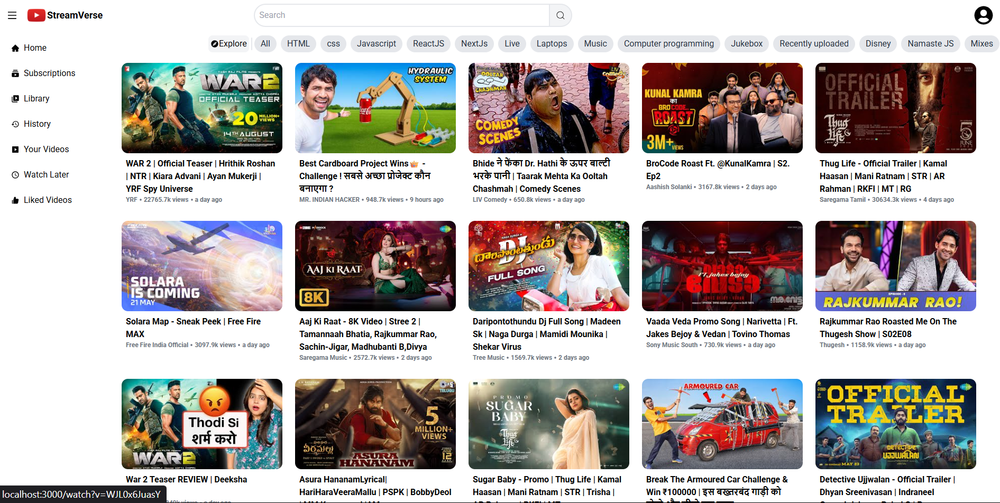
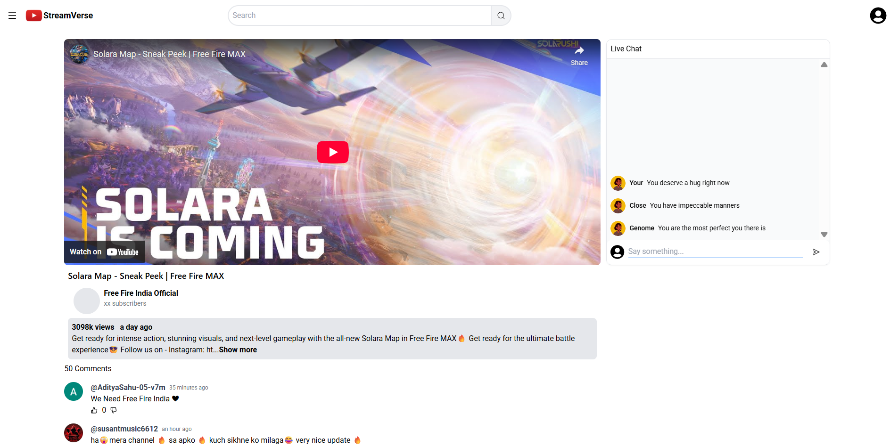

# 🎥 Stream Sphere – Next-Gen Video Streaming Platform  

## 📌 Overview  
**Stream Sphere** is a powerful **full-stack video streaming platform** built with modern technologies to deliver a rich user experience. With seamless **YouTube API integration**, real-time chat, and AI-powered moderation, Stream Sphere aims to redefine how users discover and interact with video content.  

Inspired by platforms like **YouTube** and **Twitch**, Stream Sphere provides intelligent recommendations, blazing-fast performance, and interactive features to boost viewer engagement.  

---

## 👥 User Roles  
- 🔹 **Viewers** – Search, stream, and interact with videos.  
- 🔹 **Moderators (Optional)** – Monitor chats and comments (powered by AI sentiment analysis).  

---

## ✨ Features  

### 🎯 *Core Streaming Module*  
- 🔎 **Video Search & Playback** – Integrated with **YouTube API** for real-time search and streaming.  
- 🤖 **Smart Recommendations** – AI-enhanced suggestions based on watch history.  

### 💬 *Live Chat & Community*  
- 💬 **Real-Time Chat** – Powered by **WebSocket** for instant messaging during video streams.  
- 💡 **Threaded Comments** – Custom comment section with support for nested replies.  
- 🧠 **Sentiment Analysis** – AI moderation to detect toxic or inappropriate content.  

### 🚀 *Performance & Optimization*  
- ⏱️ **Optimized Loading** – Implemented **lazy loading**, **code splitting**, and **API caching**.  
- 📉 **40% Load Time Reduction** – Achieved significant performance boosts across devices.  

---

## ⚙ Tech Stack  

### 🎯 **Frontend**
- **Framework** – ReactJS  
- **Styling** – Tailwind CSS for sleek, responsive UI  
- **State Management** – Redux Toolkit  

### 🎯 **Backend & APIs**
- **Video Source** – YouTube Data API  
- **Real-Time Communication** – WebSocket for live chat  
- **AI Moderation** – Integrated AI sentiment analysis (conceptual/optional)

---

## 🖌 UI Highlights (Coming Soon)  
### 🏠 Home Page

  

### 📺 Video Page

  

---

## 📅 **Development Timeline**

| **Phase**     | **Duration** | **Key Activities**                                                                 |
|---------------|--------------|-------------------------------------------------------------------------------------|
| 🚧 Planning    | Week 1       | 🔹 Define feature set   🔹 Research APIs and libraries   🔹 App structure design |
| 🛠 Development | Week 2–4     | 🔹 Implement core video module   🔹 Add chat system   🔹 Integrate AI moderation |
| 🎨 UI Polish   | Week 5       | 🔹 Refine styling with Tailwind   🔹 Add responsiveness and animations             |
| 🧪 Testing     | Week 6       | 🔹 Debugging and optimizations   🔹 Load testing and sentiment analysis tuning     |
| 🚀 Deployment  | Week 7       | 🔹 Final deployment and documentation   🔹 GitHub and hosting setup                |

## 📞 Contact  

For contributions, feedback, or collaboration:  

📩 *Rohit Kumar* – [rohitraj42192@gmail.com](mailto:rohitraj42192@gmail.com)  

Let’s transform video streaming into a smarter, more connected experience! 🌍🔥
